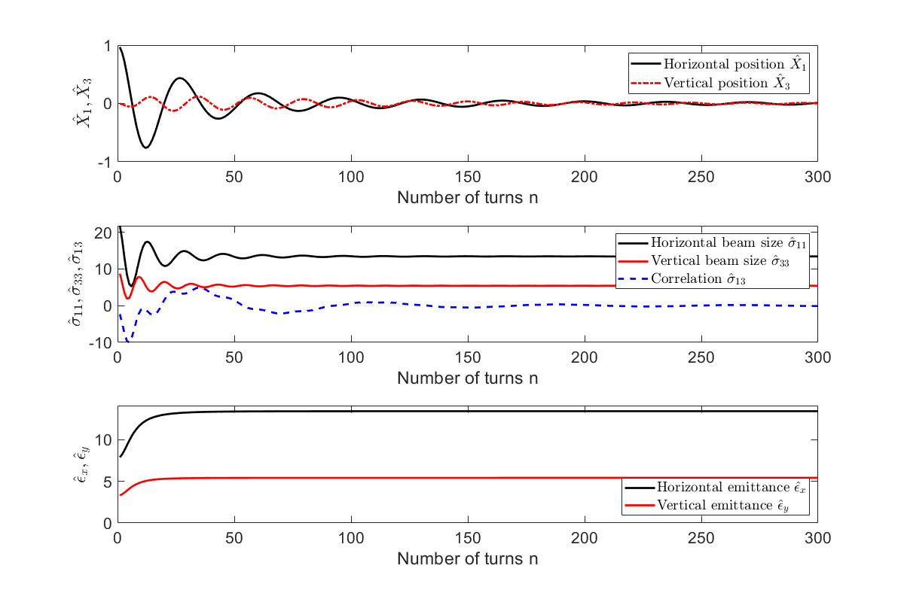

# InjectionDecoherence
The Matlab scripts prepare the plots shown in the forthcoming report 

- E. Waagard, V. Ziemann: *Emittance growth of kicked and mismatched beams due to amplitude-dependent tune shift*, [arxiv:2203.09259](https://arxiv.org/abs/2203.09259)

that show the evolution of the beam centroids, the beam matrix and the emittance after injecting into a ring 
that contains non-linearities causing amplitude-dependent tune shift. The following image from the report may serve as an illustration

The purpose of the files

  - **Jmrs_sigma.m**: calculates the 'tricky' integrals from the publication;
  - **plot_beamsize.m**: prepares the plots. You only need to change the parameters of the injected beam at the top of the file;
  - **plot_amplitude.m**: prepares Figure 1 from the report.
  - **simulation4D.m**: simulation with transverse coupling
